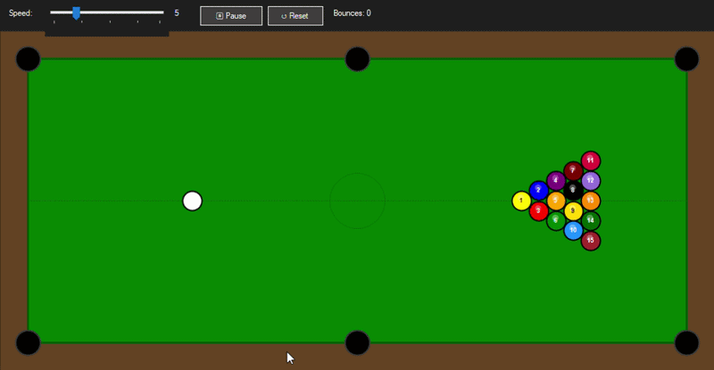

# 🎱 Bouncing Ball Simulator

A billiard-themed multi-ball physics simulation built with C# and WinForms.

## Features

- Multi-ball simulation (1–10 balls)
- Ball-to-ball elastic collision detection
- Wall bouncing physics
- Billiard table visual (green felt, brown frame, 6 pockets)
- Adjustable speed (1–20)
- Pause / Resume / Reset controls
- Live bounce counter
- Anti-aliased rendering with double buffering

## Controls

| Control | Action |
|---|---|
| Speed slider | Adjust simulation speed (1–20) |
| Balls slider | Set number of balls (1–10) |
| ⏸ Pause | Pause / Resume simulation |
| ↺ Reset | Randomize ball positions and velocities |

## Tech

- C# / .NET Framework 4.x
- WinForms (GDI+ rendering)
- `OptimizedDoubleBuffer` + `AntiAlias` for smooth animation
- Elastic collision approximation for ball-to-ball physics
